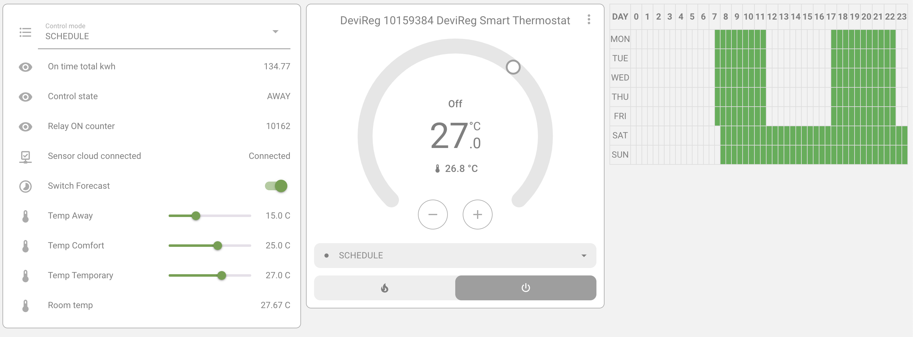

# Home Assistant MQTT Danfoss Binding




This is Home Assistant service for DeviReg Smart thermostats.
Main idea behind - integration with Home Assistant via MQTT by auto discovery (not as HA addon or HACS integration).
Around 50 sensors are implemented and can be used in Home Assistant.

## Supported Things

- DeviReg(tm) Smart floor thermostat (__supported__, tested https://www.devismart.com/)
- ~~Danfoss Icon controller~~ (__unsupported__, requires real device to implement)
- ~~Danfoss Icon room~~ (__unsupported__, requires real device to implement)

If you have Icon device and know Java a little bit - you can fork and implement it by yourself.

## Installation and supported architectures

Relies on OpenSDG library (https://github.com/Sonic-Amiga/opensdg/releases) for communicating with the hardware.
The final JAR includes all dependencies compiled in and is ready to use without installing any other dependencies.
Tested on Linux, MacOS, but should work fine on Windows as well. Docker image is also available.

## Discovery

Discovery of configuration is __required__ step to use the software.
Thermostat is using cloud security and requires setup/pairing by OTP code entry.
As it's required user input, it can't be done in Docker.  

To pair the software with the thermostat, you need mobile application paired with the thermostat.
In mobile application, you have to go to Settings -> Share house -> Generate OTP.

Steps:

1. Run the discovery tool, follow the instructions from app.
```shell
java -cp ha-devi-mqtt.jar io.homeassistant.devi.mqtt.service.DiscoveryService
```
2. Launch mobile application, enter username and OTP code (it might be required to enter OTP more then once, due to bug in library).
3. The configuration file will be generated (devi_config.json).
4. Keep the configuration file in secure place, it contains private key required to control your device.

## Runtime

Two options how to start is available.

1. Plain Java
```shell
java -cp target/ha-devi-mqtt.jar io.homeassistant.devi.mqtt.service.ConsoleRunner --auto-discovery-templates auto-discovery-templates --mqtt-config mqtt_config.json --devi-config devi_config.json
```
2. Docker (linux/amd64, linux/arm64/v8 - Mac M1)
```shell
docker run -it --rm -v $(pwd)/devi_config.json:/app/config/devi_config.json -v $(pwd)/mqtt_config.json:/app/config/mqtt_config.json -v $(pwd)/auto-discovery-templates:/app/config/auto-discovery-templates  podpalch/ha-devi-mqtt
```


## Configuration

#### **`devi_config.json (this file is generated by discovery tool)`**
```json
{
  "peerId": "Peer ID, also known as Public key. All devices on the Grid are identified by these keys",
  "privateKey": "hex coded private key",
  "houseName": "name of the house (not used anywhere in code)",
  "rooms": [
    {
      "serialNumber": "(int) serial number (used to build MQTT topic path)",
      "devicePeerID": "peer id of the thermostat",
      "name": "name of the room (not used anywhere in code, device is bound to room)"
    }
  ],
  "userName": "unique username, that was entered during the pairing"
}
```
#### **`mqtt_config.json`**
```json
{
  "host": "IP or hostname of the MQTT broker",
  "port": "1883",
  "user": "mqtt-user",
  "password": "mqtt-password"
}
```

## Schedule editing component

I've built simple lovelace Card to edit weekly schedule for this thermostat.
It's available here: https://github.com/igor-podpalchenko/ha-weekly-schedule-card

#### **`Available Sensors`**

| channel                             | type          | description                                                                                                                   | Read-only |
|-------------------------------------|---------------|-------------------------------------------------------------------------------------------------------------------------------|-----------|
| binary_sensor_cloud_connected       | Binary Sensor | Cloud connection status                                                                                                       | Y         |
| binary_sensor_heating_state         | Binary Sensor | Current heating state                                                                                                         | Y         |
| binary_sensor_warning_breakout      | Binary Sensor | Warning for breakout condition                                                                                                | Y         |
| binary_sensor_warning_disconnected  | Binary Sensor | Warning for disconnected condition                                                                                            | Y         |
| binary_sensor_warning_overheat      | Binary Sensor | Warning for overheating                                                                                                       | Y         |
| binary_sensor_warning_shorted       | Binary Sensor | Warning for short circuit                                                                                                     | Y         |
| binary_sensor_warning_unrecoverable | Binary Sensor | Warning for unrecoverable error                                                                                               | Y         |
| binary_sensor_window_open           | Binary Sensor | Whether an open window is detected in the room                                                                                | Y         |
| number_brightness                   | Number        | Thermostat screen brightness, from 0 to 100                                                                                   | N         |
| on_time_30_days                     | Time (s)      | Summary heater on time for the last 30 days                                                                                   | Y         |
| on_time_7_days                      | Time (s)      | Summary heater on time for the last 7 days                                                                                    | Y         |
| on_time_total                       | Time (s)      | Total heater on time                                                                                                          | Y         |
| on_time_30_days_kwh                 | Energy        | Energy consumption in kWh for the last 30 days                                                                                | Y         |
| on_time_7_days_kwh                  | Energy        | Energy consumption in kWh for the last 7 days                                                                                 | Y         |
| on_time_total_kwh                   | Energy        | Total energy consumption in kWh                                                                                               | Y         |
| sensor_active_setpoint              | String        | Active setpoint being used                                                                                                    | Y         |
| sensor_control_state                | String        | Current control state: "CONFIGURING", "MANUAL", "HOME", "AWAY", "VACATION", "FATAL", "PAUSE", "OFF","OVERRIDE"                | Y         |
| select_control_mode                 | String        | Current control mode: "CONFIGURING", "MANUAL", "HOME", "AWAY", "VACATION", "FATAL", "PAUSE", "OFF","OVERRIDE", "AWAY", "HOME" | N         |
| sensor_week_schedule                | JSON          | Weekly schedule in JSON format in Devi time range format                                                                      | N         |
| setpoint_antifreeze                 | Temperature   | Set point for antifreeze mode                                                                                                 | N         |
| setpoint_away                       | Temperature   | Set point for away mode                                                                                                       | N         |
| setpoint_comfort                    | Temperature   | Set point for comfort mode                                                                                                    | N         |
| setpoint_economy                    | Temperature   | Set point for economy mode                                                                                                    | N         |
| setpoint_manual                     | Temperature   | Set point for manual mode                                                                                                     | N         |
| setpoint_max_floor                  | Temperature   | Maximum allowed floor temperature                                                                                             | N         |
| setpoint_min_floor                  | Temperature   | Minimum allowed floor temperature                                                                                             | N         |
| setpoint_temporary                  | Temperature   | Temporary set point                                                                                                           | N         |
| setpoint_warning                    | Temperature   | Temperature below which an alarm is sent                                                                                      | N         |
| switch_forecast                     | Switch        | Enable or disable forecast heating                                                                                            | N         |
| switch_min_floor_enable             | Switch        | Enable keeping minimum floor temperature                                                                                      | N         |
| switch_screen_lock                  | Switch        | Enable screen lock                                                                                                            | N         |
| switch_window_detection             | Switch        | Enable open window detection                                                                                                  | N         |
| sys_firmware_version                | String        | Firmware version of the device                                                                                                | Y         |
| sys_hardware_version                | String        | Hardware version of the device                                                                                                | Y         |
| sys_info_floor_type                 | String        | Floor type information                                                                                                        | Y         |
| sys_info_output_power               | Power         | Output power of the device                                                                                                    | Y         |
| sys_info_sensor_type                | String        | Type of sensor connected                                                                                                      | Y         |
| sys_info_regulation_type            | String        | Type of regulation being used by the system                                                                                   | Y         |
| sys_info_room_type                  | String        | Type of room where the system is installed                                                                                    | Y         |
| sys_production_date                 | Date          | Device production date                                                                                                        | Y         |
| sys_relay_on_count                  | Number        | Number of times the relay has been turned on                                                                                  | Y         |
| sys_room_name                       | String        | Room name assigned to the device                                                                                              | N         |
| sys_run_time                        | Time          | Total runtime of the device                                                                                                   | Y         |
| sys_serial_number                   | String        | Serial number of the device                                                                                                   | Y         |
| sys_wifi_connect_ssid               | String        | SSID of the connected Wi-Fi network                                                                                           | Y         |
| sys_wifi_strength                   | Number        | Signal strength of the Wi-Fi connection                                                                                       | Y         |
| sys_house_name                      | String        | Name of the house or location                                                                                                 | Y         |
| sys_connection_count                | Number        | Number of connection attempts or successful connections                                                                       | Y         |
| temperature_floor                   | Temperature   | Floor temperature sensor reading                                                                                              | Y         |
| temperature_room                    | Temperature   | Room temperature sensor reading                                                                                               | Y         |


#### **`Default command topics`**

| File                          | Command Topic                                      |
|-------------------------------|---------------------------------------------------|
| number_setpoint_max_floor.json | devi/command/${deviceSN}/setpoint_max_floor        |
| number_setpoint_manual.json    | devi/command/${deviceSN}/setpoint_manual           |
| number_setpoint_warning.json   | devi/command/${deviceSN}/setpoint_warning          |
| number_setpoint_away.json      | devi/command/${deviceSN}/setpoint_away             |
| number_setpoint_min_floor.json | devi/command/${deviceSN}/setpoint_min_floor        |
| number_setpoint_temporary.json | devi/command/${deviceSN}/setpoint_temporary        |
| number_setpoint_antifreeze.json| devi/command/${deviceSN}/setpoint_antifreeze       |
| number_setpoint_economy.json   | devi/command/${deviceSN}/setpoint_economy          |
| number_setpoint_comfort.json   | devi/command/${deviceSN}/setpoint_comfort          |
| switch_min_floor_enable.json   | devi/command/${deviceSN}/switch_min_floor_enable   |
| switch_screen_lock.json        | devi/command/${deviceSN}/switch_screen_lock        |
| switch_window_detection.json   | devi/command/${deviceSN}/switch_window_detection   |
| switch_forecast.json           | devi/command/${deviceSN}/switch_forecast           |
| select_control_mode.json       | devi/command/${deviceSN}/select_control_mode       |


Note: the pairing is performed with the home, not with the concrete device. 
If you have multiple devices, all devices will be paired with software.


Protocol is called SecureDeviceGrid(tm)
(http://securedevicegrid.com/).

Original source (https://github.com/Sonic-Amiga/org.openhab.binding.devireg)